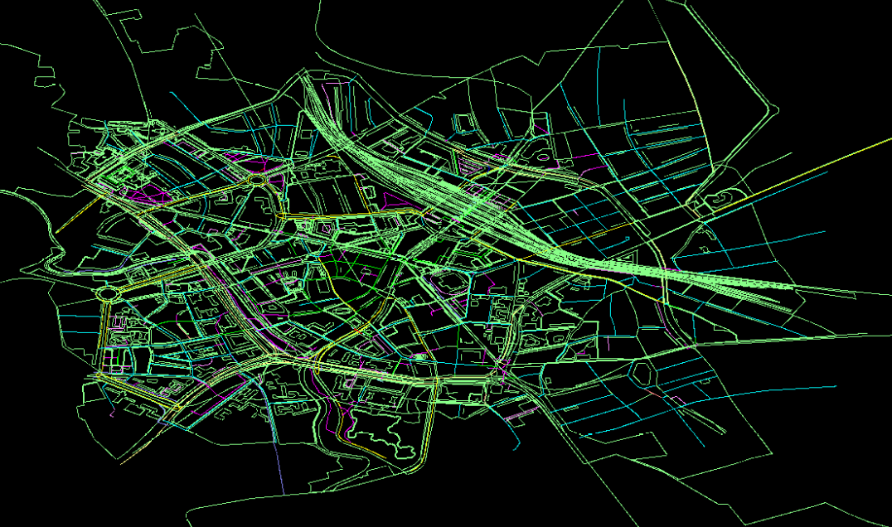

# Database application

Mario Vieilledent

29/09/2022

## Exercise 1

The over-complexity of the visualization of nodes in spaces. A couple of coordinates is easy to understand and represent in mind, then calculus on theses nodes is just basics calculus with squares and squares roots.

### Implementation in Go

Why ? Because Go allows to develop quickly and reliably, also it compiles into a efficient and fast program. I want to continue to learn Go and this exercise is good for this.

### Graphic visualization

A [Ebiten](https://ebitengine.org/) window displays all the points int the map.

Can display node and ways of CSV OSM data.

## Exercise 2 (Performance improvements):

> Think of ways to improve the performance of your program. How can you avoid fetching every way from the database? You will have to pre-calculate additional information for each way inside the database, so that you can only fetch proper candidates immediately using SQL, and so that your program only has to calculate the exact distance to those few candidate ways.

To improve the performance of the program, we should maybe use map or dictionary that allow the program to directly access to a list of geographic data with a key, and not fetch all and check their id one by one.
For a SQL implementation, it maybe would be a better idea to separate data in "chunks" that are a rectangle area, a query is searching withing a specific distance is therefore querying in closest chunks and avoid querying a too far points.