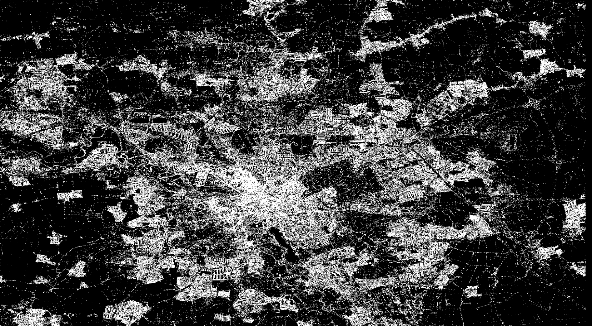

# Database application exercise 1

Mario Vieilledent

29/09/2022

## What I found hard in this exercise

The over-complexity of the visualization of nodes in spaces. A couple of coordinates is easy to understand and represent in mind, then calculus on theses nodes is just basics calculus with squares and squares roots.

## Implementation in Go

Why ? Because Go allows to develop quickly and reliably, also it compiles into a efficient and fast program. I want to continue to learn Go and this exercise is good for this.

## Graphic visualization

A [Ebiten](https://ebitengine.org/) window displays all the points int the map.

